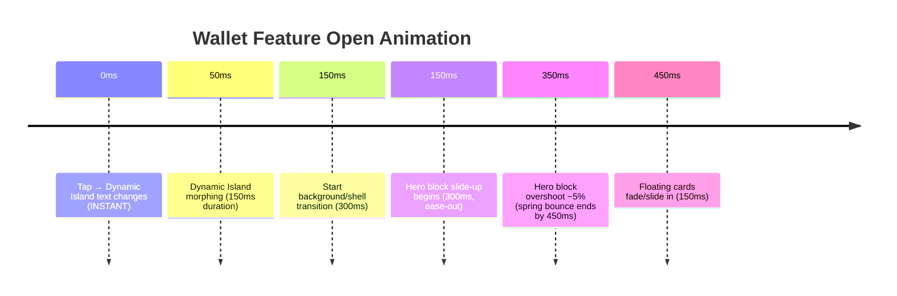
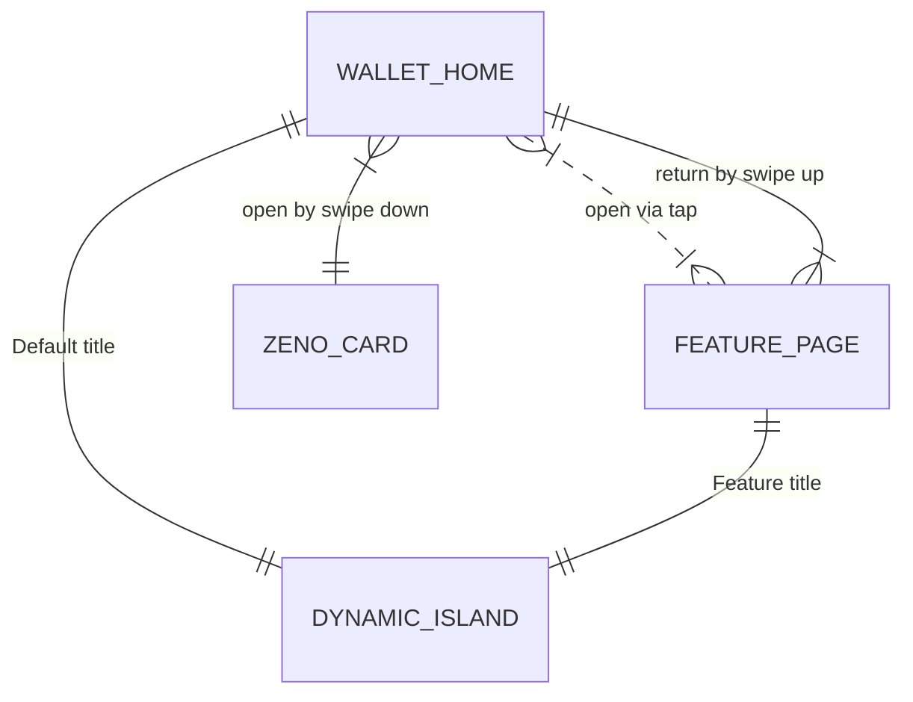

Read AGENTS.md first and follow it strictly.
## 2. Motion System

We define **precise animation specs** for transitions. All timings and easings are suggestions for a natural feel, following Apple’s HIG (avoid jarring, prefer ease in/out, spring effects). We use React Native’s Animated API (with native driver) or Reanimated (UI thread) for high performance.

### 2.1 Animation Sequences

#### 2.1.1 Wallet Home ↔ ZENO Card

- **Swipe Down (Home → ZENO Card):**
  1. User swipes down on Wallet Home. As soon as gesture begins, the Dynamic Island title instantly changes to **“ZENO CARD”**.
  2. The hero surface (dark green card block) expands downward. 
     - Duration ~300ms, easing `ease-out-back` (a quick deceleration with slight overshoot).
  3. The `ZENO Card` screen bounces in place: use a spring with damping (bounciness ~0.6) to simulate "bounce".
  4. By 400ms the card view is fully open. 

- **Swipe Up (ZENO Card → Home):**
  1. User swipes up. Immediately, the screen collapses upward.
  2. Reverse animation: hero block collapses (300ms, `ease-in`), bringing user back to Wallet Home.
  3. Once transition completes, reset Dynamic Island back to “ZENO CARD” (instantly).

#### 2.1.2 Opening a Feature (e.g. Send Money)

- **Tap Feature Button:**
  1. **Dynamic Island morph** – as soon as the button is tapped, the top pill morphs to the feature name (e.g. “SEND MONEY”). This happens immediately (0–150ms).
  2. **Background transition** – the outer background smoothly darkens or stays (depending on design); the app shell (light blue) rises into view.
  3. **Surface slide-up** – the feature’s main content block (e.g. black “Send Money” block) slides up into the phone frame.
     - Duration ~300–400ms, easing `ease-out`.
  4. **Bounce effect** – after landing, apply a quick spring back (bounciness ~0.7).
  5. Floating info cards (white cards) **fade in** (opacity 0→100%) and/or slide slightly (100ms offset).

- **Close Feature (Swipe Up):**
  1. Content block collapses downward (300ms, `ease-in`).
  2. Outer screen returns to Home state; Dynamic Island resets to “ZENO CARD” instantly.

#### 2.1.3 Timeline (Mermaid)



#### 2.1.4 Gesture Thresholds

- **Swipe activation:** Vertical drag of ≥150pt or a fast swipe (velocity threshold ~1.5 pts/ms) triggers feature open/close. Otherwise, cancel transition.
- **Dynamic Island:** Title should change **before** animation to avoid lag (so user sees context before motion).
- **Fallback:** If interrupted (e.g. user lifts finger), animate back to initial position (500ms, ease-out) or complete transition if past midpoint.

### 2.2 Animations Checklist

- **Reduced Motion:** If OS “Reduce Motion” is on, minimize spring bounces and long transitions.
- **Performance:** Use `useNativeDriver: true`. Keep animations <60ms per frame (120fps if possible with Reanimated).
- **Expo APIs:** We can use Expo’s `LayoutAnimation` for simple fades, and `PanResponder` or Gesture Handler for swipes.

## 3. Wallet Navigation State Machine

We treat the Wallet as a **vertical stack** of “rooms”, not a typical scroll. The state machine in TypeScript:

```ts
type WalletScreen = 
  | 'HOME'      // Wallet Home
  | 'CARD'      // ZENO Card view
  | 'SEND'      // Send Money
  | 'GETPAID'   // Get Paid
  | 'ADD'       // Add Money
  | 'WITHDRAW'; // Withdraw Money

interface WalletNavState {
  current: WalletScreen;
  previous?: WalletScreen;
}

const useWalletNav = create<WalletNavState>((set) => ({
  current: 'HOME',
  previous: undefined,
  navigateTo: (screen: WalletScreen) => set(state => ({
    previous: state.current,
    current: screen
  })),
  goHome: () => set(state => ({
    previous: state.current,
    current: 'HOME'
  })),
}));
```

- **Rules:**
  - **Home ↔ Features:** From `HOME`, `navigateTo(screen)` sets `current = screen`.  To return: `goHome()` resets `current = 'HOME'`.
  - **ZENO Card:** No button on home; it’s reached by swipe.  A `swipeDown` sets `current = 'CARD'`; `swipeUp` from `CARD` goes home.
  - **Hierarchy:** `GETPAID` has sub-screens (`CREATE_LINK`, `REQUEST`, `QR_SCANNER`). Those can be modeled as separate `WalletScreen` or nested routes in navigation.

#### 3.1 State Diagram (Mermaid ER)



- `WALLET_HOME` shows `DYNAMIC_ISLAND` labelled “ZENO CARD”. Each `FEATURE_PAGE` shows `DYNAMIC_ISLAND` with its title (e.g. “SEND MONEY”).
- The state machine ensures consistent transitions and island text changes.

## 4. Component and File Structure

Key components (with suggested file locations):

- **DynamicIsland** (`components/ui/DynamicIsland.tsx`)  
  *Props:* `title:string` – the current feature name (e.g. “ZENO CARD”, “SEND MONEY”).  
  *Responsibility:* Renders the top pill-shaped bar. Uses `.zeno-dynamic-island` utility for styling. Listens to WalletNavigation store to update text.

- **HeroBlock** (`components/wallet/HeroBlock.tsx`)  
  *Props:* `children: ReactNode`, `bgColor:string` (e.g. dark green or black), `rounded?: boolean`.  
  *Responsibility:* The main colored content area of a wallet screen (e.g. balance, card). Applies `.zeno-hero` styles, background color from theme tokens.

- **AppShell** (`components/ui/AppShell.tsx`)  
  *Props:* `bgColor:string`, `children`.  
  *Responsibility:* The phone-shaped container behind HeroBlock. It sets a light colored background (e.g. light blue or green) per feature.

- **FloatingCard** (`components/ui/FloatingCard.tsx`)  
  *Props:* e.g. `header: ReactNode`, `content: ReactNode`.  
  *Responsibility:* White card container floating above the hero block (e.g. transaction items). Styles from `.zeno-float-card`.

- **PrimaryButton** (`components/ui/PrimaryButton.tsx`)  
  *Props:* `title:string`, `onPress:() => void`.  
  *Responsibility:* A rounded action button using `.zeno-action-btn`.

- **WalletNavigationController** (`store/wallet-nav.ts`)  
  *Exports:* Hooks/functions: `useWalletNav` store (above), `navigateTo`, `goHome`.

- **Screen components** (in `app/wallet/` folder for Expo Router):  
  - `WalletHome.tsx`, `ZenoCard.tsx`, `SendMoney.tsx`, etc. Each composes above components and connects to navigation. They do not handle raw gestures themselves except calling `navigateTo()` or `goHome()`.

File map example:
```
src/
├─ app/
│   ├─ (auth)/            # login/signup screens (stack navigator)
│   ├─ (wallet)/          # wallet ecosystem screens (custom nav)
│   │   ├─ index.tsx      # WalletHome screen
│   │   ├─ card.tsx       # ZenoCard screen
│   │   ├─ send-money.tsx
│   │   ├─ get-paid.tsx
│   │   ├─ add-money.tsx
│   │   └─ withdraw-money.tsx
│   ├─ (account)/         # profile/settings screens (stack navigator)
│   │   ├─ settings.tsx
│   │   └─ ...
│   └─ _layout.tsx        # global navigation (Stack for Auth/Account)
│
├─ components/
│   ├─ ui/
│   │   ├─ DynamicIsland.tsx
│   │   ├─ AppShell.tsx
│   │   ├─ FloatingCard.tsx
│   │   ├─ PrimaryButton.tsx
│   │   └─ ...
│   └─ wallet/
│       ├─ HeroBlock.tsx
│       ├─ BalanceDisplay.tsx
│       └─ ...
│
├─ store/
│   ├─ wallet-nav.ts       # Zustand store for Wallet navigation
│   ├─ auth-store.ts
│   └─ ...
│
├─ constants/
│   ├─ colors.ts
│   ├─ typography.ts
│   ├─ spacing.ts
│   └─ radius.ts
└─ assets/
    └─ images/             # logos, illustrations, etc.
```

Each **screen** file should be light: compose UI components, subscribe to the wallet nav store, and call navigation actions or gestures. No heavy logic or styling in screens.

## 5. Implementation Plan & Tasks

**Libraries:** We use Expo/React Native defaults. No new major libraries without approval. For animations, use React Native’s `Animated` (native driver) or Reanimated (if needed for smooth 120fps). For gestures, use `react-native-gesture-handler` (already in Expo) with PanResponder or GestureDetector.

### 5.1 Technology Choices

- **Animations:** Prefer built-in Animated API (JS-driven, with `useNativeDriver: true`) for simple transitions. *Option:* If profiling shows jank, consider Reanimated 3/4 (runs on UI thread).  
- **Navigation:** Use **Expo Router**. Auth and Account flows: stack/tab navigators per Expo docs. Wallet: **custom store** as above (no React Navigation) for vertical swipe effect.  
- **Styling:** NativeWind (Tailwind for RN) per project guidelines. Use utility classes and global.css as planned.  
- **State:** Zustand (already chosen) for wallet nav and global state.  
- **Images/Assets:** Store logos, icons in `assets/images/`. Manage via `constants/images.ts`.

### 5.2 Step-by-Step Tasks (est. hours)

| Task                                               | Est. Hours |
|----------------------------------------------------|-----------:|
| 1. Define and export design tokens (colors, type).  | 2h        |
| 2. Configure NativeWind theme & global CSS utils.   | 3h        |
| 3. Build core UI components (DynamicIsland, HeroBlock, etc.) | 6h |
| 4. Set up Wallet navigation store (Zustand).       | 2h        |
| 5. Implement Wallet Home UI (balance, actions).    | 4h        |
| 6. Implement ZENO Card screen UI.                  | 3h        |
| 7. Implement Send Money UI structure.              | 4h        |
| 8. Wire up animations/transitions for wallet nav.  | 6h        |
| 9. Build other features (Get Paid, Add/Withdraw)   | 6h        |
| 10. Implement Auth & Account flows (basic stack)   | 5h        |
| 11. Accessibility audit & testing.                 | 3h        |
| 12. Iterate/performance tuning.                    | 4h        |
| **Total**                                          | **48h**   |

Each feature should be built MVP-style first, then refined (colors, shadows, polish). 

### 5.3 Animation Approach Comparison

| Approach           | Pros                                                  | Cons                                 |
|--------------------|-------------------------------------------------------|--------------------------------------|
| **Animated API**   | Built-in, no extra deps, well-documented. `useNativeDriver` for smooth UI-thread animations. | JS-driven (unless native driver); can drop frames if JS busy. |
| **Reanimated**     | Runs on native UI thread by default, ultra-smooth (120fps). Powerful gesture integration. | Adds dependency; steeper learning curve; larger bundle. |
| **Lottie/Rive**    | Great for complex vector animations (pre-made JSON). | Overkill for simple UI transitions; extra toolchain; big file size. |

*Recommendation:* Use Animated (native driver) for basic transitions. Evaluate Reanimated if animations stutter or for complex gestures. Defer Lottie/Rive unless a custom illustration (e.g. intro) is needed.

## 6. Accessibility, Performance & Testing

- **Accessibility:** All interactive elements must have accessible labels (e.g. buttons labeled for screen readers). Ensure color contrasts meet WCAG (primary blue on white, etc). Respect “Reduce Motion” setting by minimizing nonessential animation (e.g. skip bounces). All text (dynamic island, buttons) should be large enough (14px+) and not truncated.
- **Performance:** Use `useNativeDriver: true` for animations. Avoid anonymous functions in render. Memoize components. Test on low-end devices (smooth at 60fps). Lazy-load sub-screens to keep initial bundle small.
- **Testing:** Write unit tests for business logic. E2E or component tests for navigation flows. Verify that wallet balance and transactions only update via backend calls (no client-side trust). Test forms (Add Money, KYC) for input validation. Confirm no API keys on client.

## 7. Assets & Exports

Generate and store in `assets/images/`:

- **Logos:** ZENO wordmark (Zalando Condensed). Export as SVG, and PNG at sizes 120x, 24x (for App icon), and full-res (1080w) for web splash.
- **Dynamic Island Graphics:** Create small capsule backgrounds (transparent PNG) with placeholders “ZENO CARD” and “SEND MONEY” text (fonts: SF Pro). Provide as 390x40px images (approx) or layered in code (could just use `Text` on capsule).
- **Illustrations/Icons:** Any needed – e.g. empty-state illustr. Use SVG or PNG. Ensure optimized (SVG preferred for icons).
- **Export Specs:** 
  - **App Icon:** 1024x1024 PNG (Apple/Android sizes via asset builder).
  - **Logo (for Figma):** 500x150 PNG with transparent bg.
  - **Mockup Screens:** We include three PNGs at 390x844 (iPhone 14) for #a/#b; dynamic island image (390x80).
  - **Figma Guidance:** E.g. “Design frames at 390×844pt (iPhone 14). Use the above color/typography tokens exactly. Export PNG with 3x scale (1170×2532px).”
